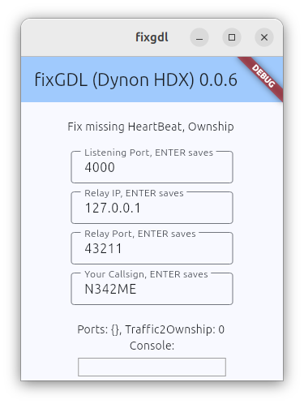

## fixGDL
A simple Android app to fix Dynon's HDX GDL90 non-compliance: missing Heartbeat and Ownship messages.  
USE AT YOUR OWN RISK, NOT SUITABLE FOR SAFETY-OF-FLIGHT USE.

Listens on port 4000 and retransmits locally (127.0.0.1) on port 43211.  Start fixGDL first, then EFB.
* Missing Heartbeat is transmitted
* Bogus Traffic report for your ship (e.g. N342ME) modified to Ownship and transmitted
   * this removes the "ghost" traffic of your own ship
   * create the missing Ownship
* All other GDL90 messages are retransmitted without changes (Uplink for weather products, etc.)
* 0.0.6 makes listen/transmit port/IP and own_ship callsign configurable.
  * Listening Port (e.g. 4000) requires a restart; other params take effect immediately
* Tested with EFBs on Android/Linux: fltplan.com Go, Avare, AvareX

 

### This is a work in progress; future ideas:
* Should make callsign use ICAO mode-S, as more reliably unique...
* could add non-standard AHRS messages (stratux, iLevil) using Dynon protobuf or serial data as basis
  (but just an idea; I don't use/need a backup AHRS/PFD display).

#### See related/previous work:
* [GDL90 Tester](https://github.com/b-spatz/gdl90)
* Dynon issues reported: https://forum.flydynon.com/threads/ads-b-over-wifi.15650/page-2#post-92735
