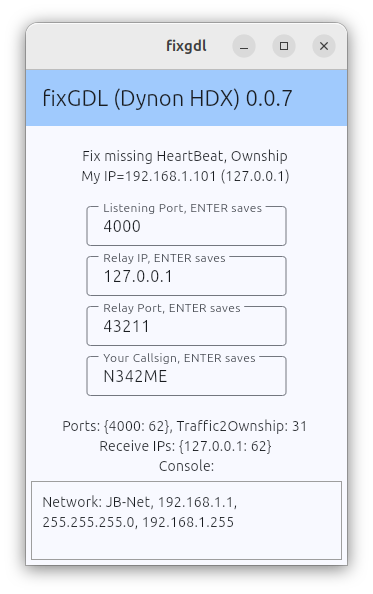

## fixGDL
A simple Android app to fix Dynon's HDX GDL90 non-compliance: missing Heartbeat and Ownship messages.
Makes HDX GDL90 stream more standards compliant and thus more usable by EFBs or other GDL90 clients.

USE AT YOUR OWN RISK, NOT SUITABLE FOR SAFETY-OF-FLIGHT USE.

### Overview
```
    defective          corrected
      GDL90              GDL90
HDX ----------> fixGDL ----------> EFB/client
     WiFi UDP           WiFi UDP
```

Listens on port 4000 and retransmits locally (127.0.0.1) on port 43211 (configurable).  Start fixGDL first, then EFB.
(or start EFB first, then fixGDL: depends on EFB socket binding specifics SO_REUSE{ADDR,PORT})
* Missing Heartbeat is transmitted (~ every second, e.g. 1 Hz)
* Bogus Traffic report for your ship (e.g. N342ME) modified to Ownship and transmitted
   * this removes the "ghost" traffic of your own ship
   * create the missing Ownship
* All other GDL90 messages are retransmitted without changes (Uplink for weather products, etc.)
* 0.0.6 makes listen/transmit port/IP and own_ship callsign configurable
  * Listening Port (e.g. 4000) requires a restart; other params take effect immediately
* 0.0.7 identifies my IP network, tracks source IP (e.g. HDX); some byte stuff debugging (working OK)
* Tested with EFBs on Android/Linux: fltplan.com Go, Avare, AvareX, IFD440 (!)
* May be used on same device as EFB (e.g. use 127.0.0.1), or relay to other device (e.g. IFD440)

 

### This is a work in progress; future ideas:
* Should make callsign use ICAO mode-S, as more reliably unique...
* Could add non-standard AHRS messages (e.g. from stratux, iLevil) using Dynon protobuf or serial data as basis
  (but just an idea; I don't use/need a backup AHRS/PFD display).

#### See related/previous work:
* [GDL90 Tester](https://github.com/b-spatz/gdl90) (including GDL90 specifications, etc.)
* Dynon issues reported: https://forum.flydynon.com/threads/ads-b-over-wifi.15650/page-2#post-92735
